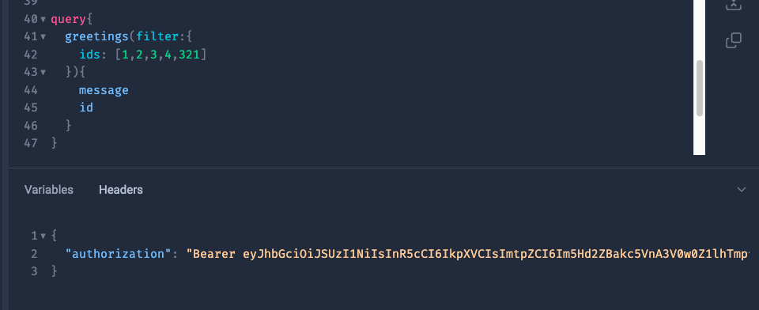
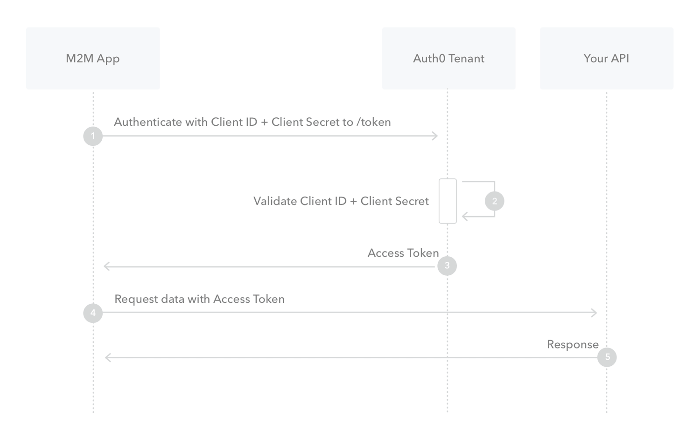
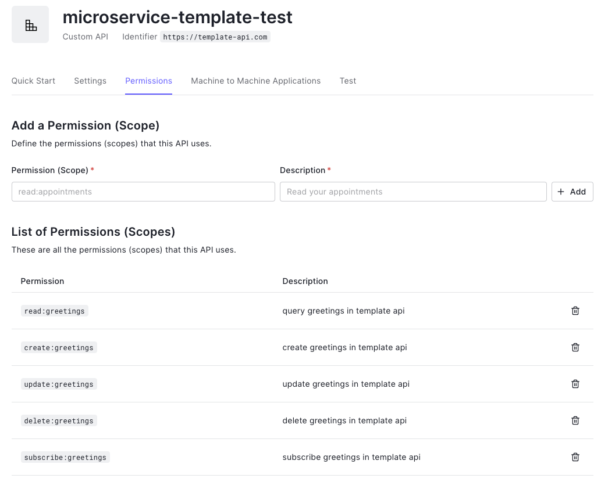

# Getting Started

## Netflix DGS

We are using Netflix DGS for model class generation (Based on the schema) and exposing the GraphQL operations through DGS annotations. To learn more about DGS: https://netflix.github.io/dgs/

### Java
This is a Gradle project that compiles/runs with Java 19 JDK. Refer to the instructions in the shared repo to [Getting Java](https://github.com/triplelift-internal/shared#getting-java).

## Gradle
See [Gradle](https://github.com/triplelift-internal/shared#gradle) in the shared repo's README.md for details.

### Spring Annotations
For Intellij users, if the IDE cannot find functions on models with the [`@Data` annotation](https://projectlombok.org/features/Data), then [in project settings enable Annotation Processing and ensure the `Lombok` plugin is installed](https://stackoverflow.com/questions/24006937/lombok-annotations-do-not-compile-under-intellij-idea).

### Spring Caching
This repo has caching enabled on Greetings.
- The cache configuration is handled through the `ehcache.xml` files where you can configure caches, sizes, eviction policies.
- Spring Caching is handled entirely through annotations

#### important caching annotations
- `@Cacheable` is used to indicate that the result of invoking a method (or all methods in a class) can be cached in a map.
- `@CacheEvict` is used to evict as single or all entries from a cache.

[additional reference](https://spring.io/guides/gs/caching/)

## Linting
We use spotless to check formatting. Your PR's will fail to build if your formatting is improper. Please ensure you install the proper formatter as specified below for your IDE.

You can check formatting using:
```
./gradlew :test-code-quality-tools-api:spotlessCheck
```

You may apply formatting using:
```
./gradlew :test-code-quality-tools-api:spotlessApply
```

### Code Generation
You can trigger the classes generation with the command:
```
./gradlew build
```

This will create all POJOs from the GraphQL schema in the `./test-code-quality-tools-api/build/generated/sources/dgs-codegen` path

In eclipse, you have to delete the classpath file (`./test-code-quality-tools-api/.classpath`) and rebuild the project to create a new one.

-----

### Subscriptions
You can find an example of a subscription in the `SubscriptionDataFetcher` class. In order to subscribe to the `subscribeToGreetings` method:

1) Install `graphqurl` using `npm`
```
npm install -g graphqurl
```

2) Subscribe to the method using WebSocket protocol
```
gq ws://localhost:8080/subscriptions -q "subscription { subscribeToGreetings { success message code greetings { __typename id message } } }"
```
-----
## Running the server
The simplest way to run the server is to open a new terminal window, and run it from the root of the project:
```
cd test-code-quality-tools-api
./gradlew :test-code-quality-tools-api:clean && ./gradlew :test-code-quality-tools-api:build
java -jar test-code-quality-tools-api/build/libs/test-code-quality-tools-api.jar
```

NB: There are other ways to run the application (e.g. in your IDE, or using `./gradlew bootRun`), but the above best
simulates how the jar is run in production, while other methods like `bootRun` might not catch subtle build-related bugs.

## GraphQL endpoints
The following endpoints are available once the project is running.

### GraphiQL
GraphiQL Client IDE that enables interaction with the test-code-quality-tools-api GraphQL server.
```
http://localhost:8080/graphiql
```


#### Sample GraphiQL Authentication


You are required to pass an access token in the header of your requests like so:

```
curl --request GET \
--url http://localhost:8080/graphql \
--header 'authorization: Bearer eyJz93a...k4laUWw'
```

You can see details on how to get your access token below

-----

### Auth0 Authentication
This repository leverages Auth0 for Machine to Machine authentication. It is currently tied to the **microservice-template-api** within the https://manage.auth0.com/dashboard/us/triplelift-playground/ tenant. You need an invite to be able to access the Auth0 portal. 

You can read more about how to integrate Auth0 Integration for microservices here: [Auth0 integration for microservices](https://triplelift.atlassian.net/wiki/spaces/~621d5ae359c0740069d6ef96/pages/3031662939/Auth0+integration+for+microservices)


This is the Auth0 Machine to Machine Auth flow that our template leverages:




The M2M app in this case is the Application: **microservice-template-app** within the Auth0 Portal and it is an authorized application for the API: **microservice-template-api** (API Identifier https://template-api.com)

### Requesting Access Token

This would be the structure of your request for an access token

```
curl --request POST \
--url 'https://YOUR_DOMAIN/oauth/token' \
--header 'content-type: application/x-www-form-urlencoded' \
--data grant_type=client_credentials \
--data client_id=YOUR_CLIENT_ID \
--data client_secret=YOUR_CLIENT_SECRET \
--data audience=YOUR_API_IDENTIFIER
```

* YOUR_DOMAIN would your Auth0 tenant domain
* YOUR_CLIENT_ID would be the client_id of the **microservice-template-app**
* YOUR_CLIENT_SECRET would be the client_secret of the **microservice-template-app**
* YOUR_API_IDENTIFIER would be the API Identifier of the **microservice-template-api**


### Fine Grained Permissions

These are the permissions configured for the **microservice-template-api** in the Auth0 portal



These permissions are contained within your access token that you use to authenticate your GraphQL request

We manage access to our GraphQL endpoints in our GreetingDataFetcher.java file via @Preauthorize tags: 

	@PreAuthorize("hasAuthority('SCOPE_read:greetings')")
	@DgsQuery
	public GreetingResponse getInMemoryGreeting(BigInteger id) {
		return greetingService.getInMemoryGreeting(id);
	}

-----

## Sample GraphQL mutations
Variables:
```
{
  "message": "Initial Hello!",
  "greetingInput": {"id": "1", "greeting": "Updated Hello !"},
  "deleteGreetingId": 1,
}
```

Mutations:
```
// Create Greeting
mutation Mutation($message: String!) {
  createGreeting(message: $message) {
    id,
    message
  }
}

// Update Greeting
mutation Mutation($greetingInput: GreetingInput!) {
  updateGreeting(greetingInput: $greetingInput) {
    id,
    message
  }
}

//Delete Greeting
mutation Mutation(deleteGreetingId: BigInteger!) {
  deleteGreeting(id: deleteGreetingId) 
}
```

## Sample GraphQL Query

Variables:
```
{
   "greetingId":1,
   "greetingsFilter":{
      "ids":[
         1,
         2,
         3
      ]
   }
}
```

Queries:
```
// Get 1 Greeting by ID
query Query($greetingId: BigInteger!) {
  greeting(id: $greetingId) {
    id,
    message
  }
}

// Get Several Greetings by IDs
query Query($greetingsFilter: GreetingsFilter!) {
  greetings(filter: $greetingsFilter) {
    id,
    message
  }
}
```

## Tests

### Netflix DGS
Netflix DGS provides all the necessary tools to [create unit tests and integrations tests](https://netflix.github.io/dgs/query-execution-testing/).

### Cucumber
Gherkin feature files are in `test/resources/features`. Their counterpart step tests are in `/bdd/steps/`.

### JUnit
Non-BDD style unit tests can be added to the root test folder.

Mocking is done with Spring Boot Dependency injection, and mocks are configured in the TestConfig class.

https://cucumber.io/docs/cucumber/state/#spring

https://github.com/cucumber/cucumber-jvm/tree/master/spring

Be sure to set the profile to test in the bdd style tests.

### PIT Mutation Tests

PIT runs your unit tests against automatically modified versions of your application code. When the application code changes, it should produce different results and cause the unit tests to fail. If a unit test does not fail in this situation, it may indicate an issue with the test suite. More information in the [official page](https://pitest.org)

```
# From the root folder
./gradlew pitest
```

This will generate an HTML report in the `./test-code-quality-tools-api/build/reports/pitest` folder

### Creating Cucumber Docs
Run the cukeDoctor gradle task and it will generate docs in the /docs folder: `./gradlew :test-code-quality-tools-api:cukeDoctor`

### Backstage Docs

For you're service's documentation you'll want to add markdown files in repo's docs directory. These docs should be mapped by your mkdocs.yaml file to dictate page navigation in the backstage developer portal.

Documentation on how tech docs work: https://backstage.io/docs/features/techdocs/creating-and-publishing

### Code Climate

After creating a repo via the template wizard, you should have your generated repo created within Code climate. All that's left is for you to add your reporter ID from code climate as a repo secret under **CC_TEST_REPORTER_ID** in order for your test coverage to be propagated to code climate. More details here: [Configuring Test Coverage for Code Climate](https://triplelift.atlassian.net/wiki/spaces/ENG/pages/3141894165/Integrating+Code+Climate+into+your+workflow#Configure-Test-Coverage)

## Deployment

### GitHub
- Open a feature branch from the latest `develop`.
- When the feature branch is approved, perform a squash merge into `develop` to start the sand CI/CD process.
- Open a PR from `develop` to `master`.
- When `develop` is approved, perform a REGULAR MERGE into `master` to start the prod CI/CD process. Do not squash merge into master! With squash merges, GitHub generates new commits instead of fast-forwarding the existing ones, resulting in a divergence between `develop` and master. This causes future PRs from `develop` into `master` to have merge conflicts.

### Github Actions
- See the "Actions" tab in Github for builds and deploys.
- The `master` and `develop` branches will trigger deployment.
- The [`subgraph-publish-dev.yml`](../.github/workflows/subgraph-publish-dev.yml#L13) and [`subgraph-publish-prod.yml`](../.github/workflows/subgraph-publish-prod.yml#L12) actions are disabled by default to prevent test schema pushes to Apollo Studio.
  - To enable these actions remove the below given condition from the GHA yml file.
  ```agsl
    # remove this condition to enable the workflow
    if: false
  ```
  
### Deployment Strategy
The test-code-quality-tools-api is configured to run through a CI/CD deployment process through Nomad
- The Infrastructure behind the test-code-quality-tools-api will be contained in the [aws-nextgen-infra repo](https://github.com/triplelift-internal/aws-nextgen-infra/tree/master/aws/rtb/us-east-1/test-code-quality-tools-api)
- If you need to add any Infra components that relate to the test-code-quality-tools-api you can provision them through there and test that your code changes compile successfully through Terragrunt CLI

The test-code-quality-tools-api utilizes Github actions to trigger a CI/CD build pipeline as part of the `build-deploy` action
- This action starts whenever anything is pushed onto 'master'
- The action will start by running and building the Service's [dockerfile](https://github.com/triplelift-internal/test-code-quality-tools-api/blob/develop/Dockerfile)
- This docker image is then published onto the [test-code-quality-tools-api Dockerhub Repo](https://hub.docker.com/repository/docker/triplelift/test-code-quality-tools-api)
- Once published to dockerhub, the action will invoke the [nomad-deploy job spec file](https://github.com/triplelift-internal/test-code-quality-tools-api/blob/develop/nomad-deploy.hcl)
- This job spec file takes care of the actual deployment to the AWS EC2 instance which nomad takes care of. Any test-code-quality-tools-api specific secrets that need to be grabbed from Vault will be defined in this job spec file.
- You can monitor the status of the test-code-quality-tools-api service deployment on the [Production Nomad Console](https://nomad-production.triplelift.net/) (You need to be VPNed in to access this console)

#### Docker
- Images are published via Jib to registry.hub.docker.com/triplelift/test-code-quality-tools-api:{branch}.

#### Dev
- https://test-code-quality-tools-api.dev.triplelift.net/graphiql
- https://test-code-quality-tools-api.dev.triplelift.net/health
- https://test-code-quality-tools-api.dev.triplelift.net/metrics

#### Prod
- https://test-code-quality-tools-api.prod.triplelift.net/graphiql
- https://test-code-quality-tools-api.prod.triplelift.net/health
- https://test-code-quality-tools-api.prod.triplelift.net/metrics

## Logging
- Logging for this service will output to [Cloud Watch](https://console.aws.amazon.com/cloudwatch/home?region=us-east-1#logsV2:log-groups/log-group/test-code-quality-tools-api-production) (You need to be logged into AWS via SSO to view these logs)

The resulting logs can be viewed in [Grafana Loki](https://grafana.triplelift.net/explore?orgId=1&left=%5B%22now-6h%22,%22now%22,%22Loki%20Prod%22,%7B%22expr%22:%22%7Bapp%3D%5C%22test-code-quality-tools-api-service%5C%22%7D%20QueryMetadata%22%7D,%7B%22mode%22:%22Logs%22%7D,%7B%22ui%22:%5Btrue,true,true,%22none%22%5D%7D%5D).

## Grafana Dashboard
At a glance monitoring of the service may be performed through the Grafana Dashboard for both Dev. and Prod. The Grafana Dashboard is set up to scrape the [Prometheus Metrics for Dev.](https://test-code-quality-tools-api.dev.triplelift.net/metrics) as well as the [Prometheus Metrics for Prod.](https://test-code-quality-tools-api.prod.triplelift.net/metrics). PagerDuty is integrated, but alerting is only configured for Prod.

Note: If you are querying within the log retention period, but not seeing a full set of results, then you are likely running into the UI display row limit. Try filtering the logs by "Custom time range" for your specific period of interest.

## Releases 

In order to initiate a release we will need to go through a few manual steps

- Run the action titled "Draft new release"
  - Click "Run workflow" 
  - For a standard release: branch=develop, type=release
  - This will create a pull request to merge develop -> master and require appropriate sign off from all involved parties
  - 
- Approve/Merge PR "Automation: Release X.X.X" once all checks/approvals pass
- This will automatically kick off an action titled " Publish new release"
- This action is responsible for creating a pr updating the version in develop and setting it as a snapshot
- Approve the PR "Automation: Merge main (X.X.X) into develop" upon review


## 
<i>Created from Microservice Template version: 1.1.13</i>
